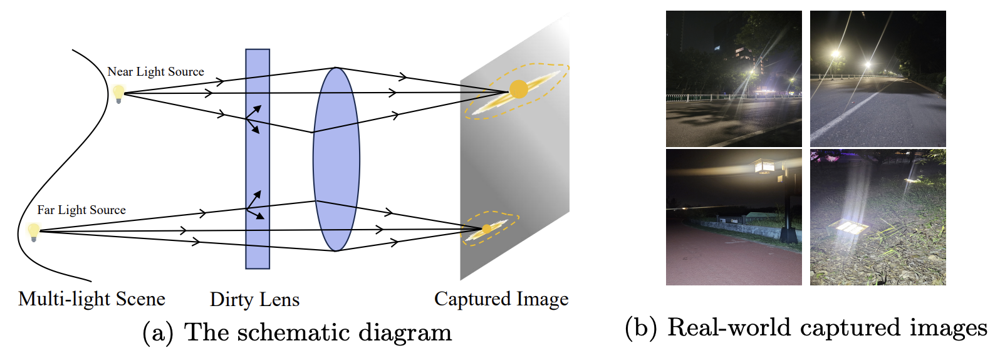
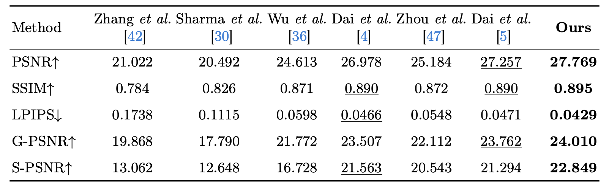
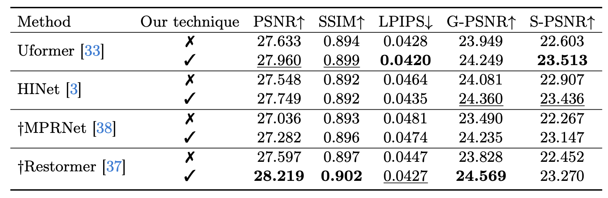

# Harmonizing Light and Darkness: A Symphony of Prior-guided Data Synthesis and Adaptive Focus for Nighttime Flare Removal



This repository provides the official implementation for the following paper:

Harmonizing Light and Darkness: A Symphony of Prior-guided Data Synthesis and Adaptive Focus for Nighttime Flare Removal

### Installation

1. Clone the repository

   ```bash
   git clone https://github.com/qulishen/Harmonizing-Light-and-Darkness.git
   ```
2. Install dependent packages

   ```bash
   cd FlareX
   pip install -r requirements.txt
   pip install torch==1.12.1+cu102 torchvision==0.13.1+cu102 torchaudio==0.12.1 --extra-index-url https://download.pytorch.org/whl/cu102

   ```
3. Install basicsr

   ```bash
   python setup.py develop
   ```

4. Install Gradio (if you need demo)
    ```bash
   pip install gradio
    ```
### Demo based on Gradio

1. You can run the demo by:

   ```bash
   python server.py --model_path "checkpoint/path"
   ```

### Data Download

Please follow their instructions to download the Flare7K and Flare7Kpp datasets:


[Flare7K: A Phenomenological Nighttime Flare Removal Dataset](https://github.com/ykdai/Flare7K)

### Prepare the Depth Images

Download the pre trained DPT model in advance and place it in the dpt folder.

[dpt_hybrid-midas-501f0c75.pt](https://github.com/intel-isl/DPT/releases/download/1_0/dpt_hybrid-midas-501f0c75.pt)

```bash
python obtain_depth_map.py -i dataset/Flickr24K -o dataset/24K_res/ -m dpt/dpt_hybrid-midas-501f0c75.pt
```

### Inference Code

1. The test code is as follows:

```bash
python test.py --input dataset/Flare7Kpp/test_data/real/input --output result/uformer/ --model_path experiments/flare7kpp/net_g_last.pth --model_type Uformer(or Restormer,MPRNet,HINet)
```

2. If the image size is greater than 512*512,  the image the test code is as follows:

```bash
python test_large.py --input dataset/Flare7Kpp/test_data/real/input --output result/uformer/ --model_path experiments/flare7kpp/net_g_last.pth --model_type Uformer(or Restormer,MPRNet,HINet)
```

### Evaluation Code

To calculate different metrics with our pretrained model, you can run the `evaluate.py` by using:

```
python evaluate.py --input result_path/blend/ --gt dataset/Flare7Kpp/test_data/real/gt/ --mask dataset/Flare7Kpp/test_data/real/mask/
```





### Training model

**Training with single GPU**

If you want to train different models, you can use the following different commands:

```bash
#Uformer
python basicsr/train.py -opt options/uformer_baseline_option.yml
```

```bash
#Restormer
python basicsr/train.py -opt options/restormer_baseline_option.yml
```

```bash
#MPRNet
python basicsr/train.py -opt options/mprnet_baseline_option.yml
```

```bash
#HINet
python basicsr/train.py -opt options/hinet_baseline_option.yml
```

**Training with multiple GPU**

You can run the following command for the multiple GPU tranining:

```
CUDA_VISIBLE_DEVICES=0,1 bash scripts/dist_train.sh 2 options/uformer_baseline_option.yml
```

### Dataset structure

```
  ├── 24K_res

  ├── Flare7Kpp
    ├── Flare7K
        ├── Reflective_Flare 
        ├── Scattering_Flare
            ├── Compound_Flare
            ├── Glare_with_shimmer
            ├── Core
            ├── Light_Source
            ├── Streak
    ├── Flare-R
      ├── Compound_Flare
      ├── Light_Source
    ├── test_data
        ├── real
              ├── input
              ├── gt
              ├── mask
        ├── synthetic
              ├── input
              ├── gt
        ├── mask

  ├── Flickr24K
```
